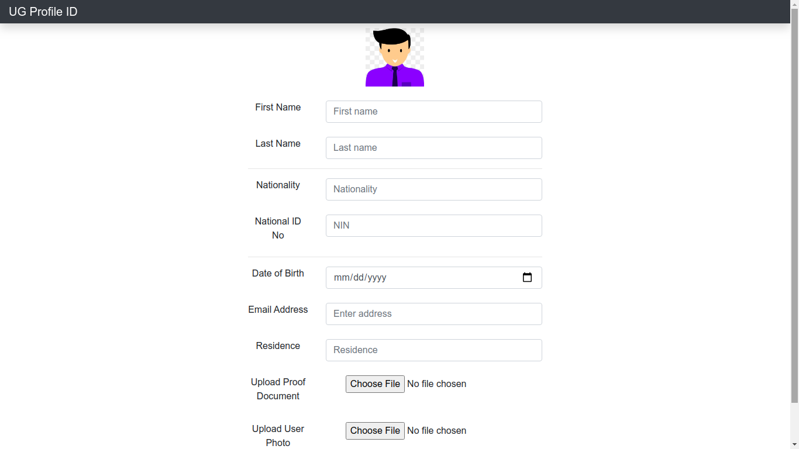

# UG Profile ID webApp

This React project is a web dApp deployed to ethereum blockchain.

## Look and Feel

### Form to capture input.

   

## About the application.

The Web application acts as input to create a [digital profile ID](https://github.com/NAGERI/UG-Profile-ID), whereby a user can have all their Identity cards in one.
The User can also upload documents on the app to act as proof, ( of which are uploaded on [IPFS](https://ipfs.io/) and the hash kept on blockchain).

### NOTE: This is not the final version.

 

### Credit.

I used this resource to get my application up and running.

- From [Gregory McCubbin](https://github.com/gwmccubbin) i got this boilerplate [Stater Kit](https://github.com/dappuniversity/starter_kit)
